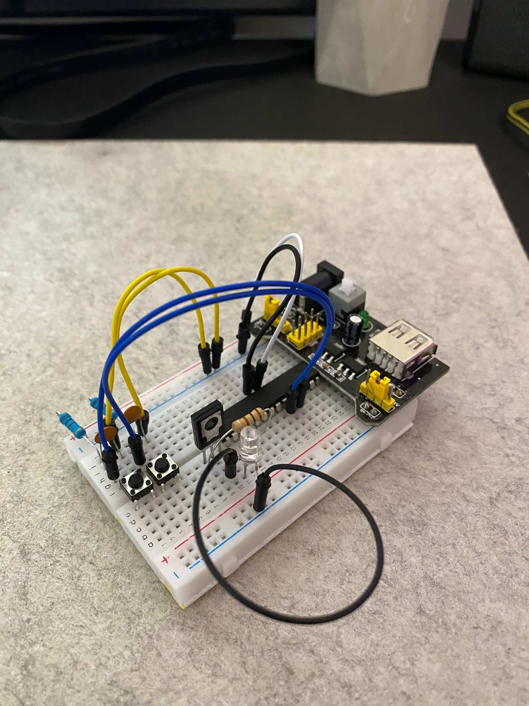
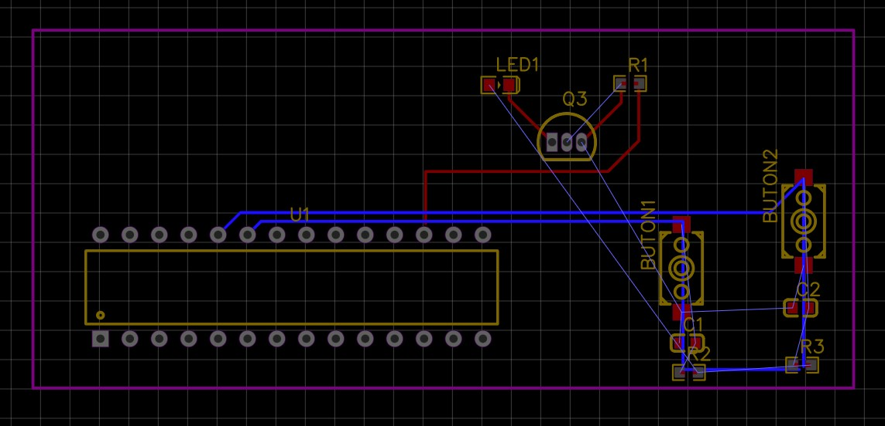
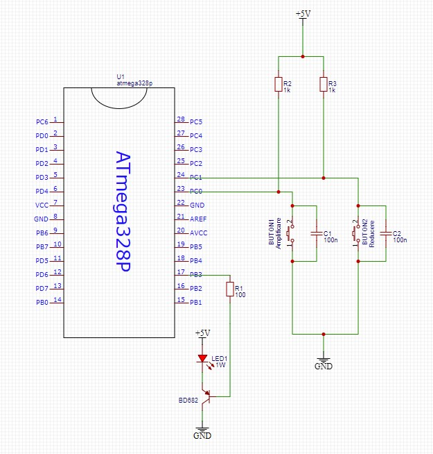

# Controlul-intensit-ii-LEDului
Proiect Aplicații cu Microcontrolere

## Hardware:

- ATMEGA328P
- Sursă (5V)
- AVR-ISP PROGRAMMER
- 2x 100uF condensator
- 1x LED 3W
- rezistență 100Ω, 2x rezistență 1KΩ
- 2 x Buton
- Tranzistor BD682

## Software:

- Microchip Studio for AVR® and SAM
- AVR Bunr-O-Mat

## Breadboard

## PCB Layout:

## Schematic:

