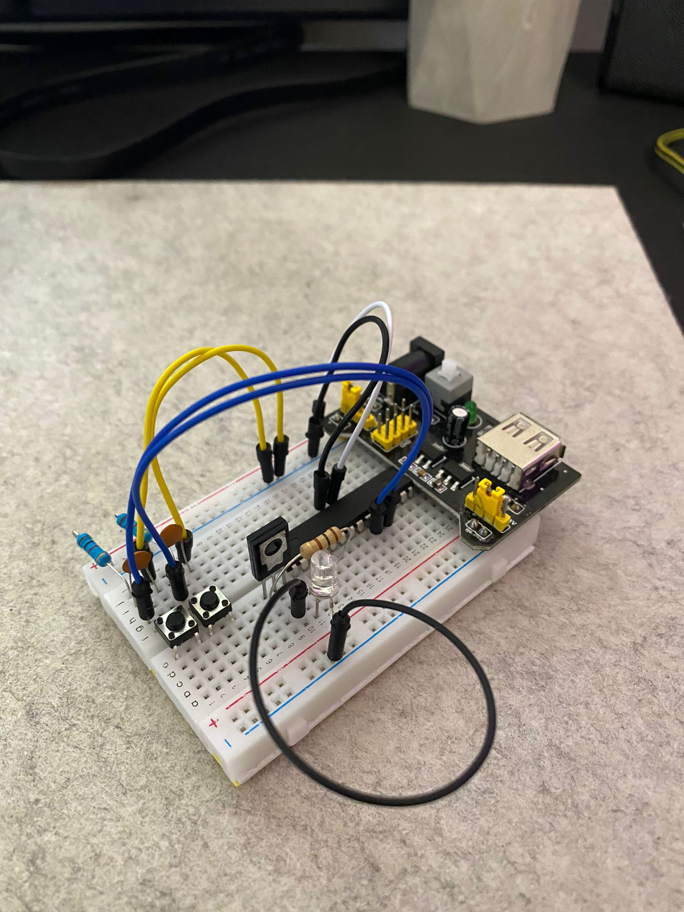
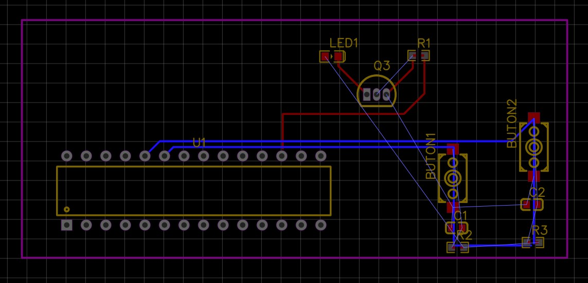
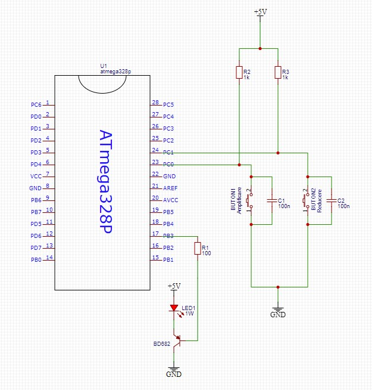

## Specificatii

In acest proiect vom avea posibilitatea de apasare a doua butoane pentru modificarea intensitatii luminoase a unui LED. Primul buton va creste intensitatea luminoasa a LEDului la fiecare apasare,
in timp ce cel de-al doilea buton (cel din dreapta, conectat la pinul 1 al portului C) va scadea intensitatea LEDului cu fiecare apasare.

## Specificatii Hardware:

- ATMEGA328P
- Sursă (5V)
- AVR-ISP PROGRAMMER
- 2x 100uF condensator
- 1x LED 3W
- rezistență 100Ω, 2x rezistență 1KΩ
- 2 x Buton
- Tranzistor BD682

ATmega328P are 6 pini dedicati PWM OC2B, OC0B, OC0A, OC1A, OC1B, OC2A. In acest proiect am ales pinul numarul 3 al portului B (PB3). Am ales sa folosesc cate
un condensator de 100nF pentru a-l lega la fiecare din cele doua butoane avand ca scop preluarea din zgomotul produs de apasarea butoanelor. 

## Specificatii Software:

- Microchip Studio for AVR® and SAM
- AVR Bunr-O-Mat

## Breadboard

## PCB Layout:

## Schematic:

